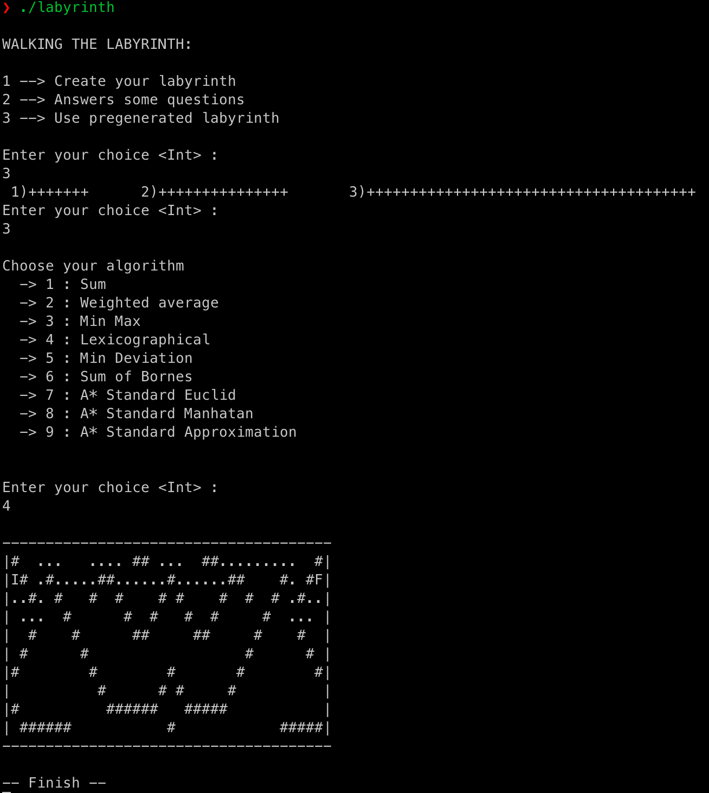

<h1 align="center">LABYRINTH</h1>

<strong>Algorithm A* and other in Haskell</strong>
 2006

 
<h2>About</h2>
This project was developed during my bachelor degree in Caen, France.
 
The code allow you to create or use pre-generated ASCII labyrinth. 
The program will propose you then some algorithm to solve the path from the input to the output of the labyrinth.
The program is fully using terminal output.
 

<h2>Installation</h2>

1. Download this project as zip and extract it
2. Install Haskell toolkit on your machine
3. Compile using 'ghc labyrinth.hs'
4. Execute the generated progam './labyrinth'

<h2>Copyright</h2>
This project is licensed under the terms of the MIT license. See <a href="LICENSE">license</a>.